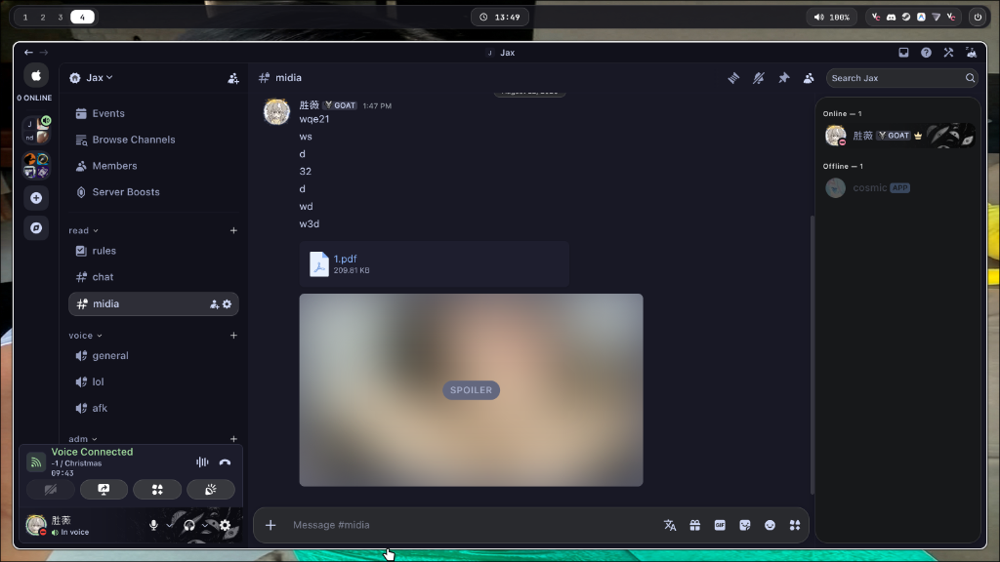

<div align="center">

  <h1>mock</h1>
  
  <p>
    <strong>a clean, minimal rounded dark gray theme for vesktop, vencord, and betterdiscord.</strong>
  </p>

  <p>
    <a href="https://github.com/unxssh/mock/stargazers"></a>
    <a href="https://github.com/unxssh/mock/network/members"></a>
    <a href="https://github.com/unxssh/mock/blob/main/LICENSE"></a>
    <a href="https://github.com/unxssh/mock/releases"></a>
  </p>

  <p>
    <a href="#-quick-install">quick install</a> •
    <a href="#-features">features</a> •
    <a href="#-preview">preview</a> •
    <a href="#-customization">customization</a> •
    <a href="#-license">license</a>
  </p>

</div>

---

## ✨ features

- **discord gray palette:** classic dark gray discord tones (`#313338`, `#2b2d31`, `#1e1f22`, `#383a40`).
- **rounded island layout:** smooth floating cards for guilds, channel sidebar, chat, and member list.
- **capsule inputs:** clean rounded textarea container and pill search bars.
- **hidden scrollbars:** distraction-free interface with scrollbars completely hidden.
- **subtle borders:** soft minimal borders and translucent focus states.
- **custom status indicators:** crisp status badges for online, idle, dnd, and offline.

---

## 📸 preview

<div align="center">
  
</div>

---

## 🚀 quick install

### option 1: quick css import (recommended)
copy and paste the following line into your vesktop / vencord **quick css**:

```css
@import url("https://raw.githubusercontent.com/unxssh/mock/main/mock.css");
```

---

### option 2: manual installation (vesktop / vencord)

1. download [`mock.css`](https://raw.githubusercontent.com/unxssh/mock/main/mock.css).
2. open **vesktop** or **discord with vencord**.
3. go to **user settings** ⚙️ > **themes**.
4. click **open themes folder**.
5. copy `mock.css` into your themes folder:
   - **linux:** `~/.config/vesktop/themes/`
   - **windows:** `%appdata%/vesktop/themes/` or `%appdata%/BetterDiscord/themes/`
6. enable **mock** in your themes list and reload with <kbd>Ctrl</kbd> + <kbd>R</kbd>.

---

### option 3: betterdiscord
download [`mock.css`](https://raw.githubusercontent.com/unxssh/mock/main/mock.css) and drop it into your BetterDiscord `themes` directory.

---

## 🎨 customization

you can easily customize colors and border radiuses at the top of `mock.css`:

```css
:root {
  --mock-bg-base: #313338;
  --mock-bg-sidebar: #2b2d31;
  --mock-bg-guilds: #1e1f22;
  --mock-bg-card: #2b2d31;
  --mock-bg-input: #383a40;

  --mock-radius-sm: 8px;
  --mock-radius-md: 12px;
  --mock-radius-lg: 16px;
  --mock-radius-xl: 20px;
  --mock-radius-pill: 9999px;
}
```

---

## 📄 license

released under the **MIT** license. see [`LICENSE`](LICENSE) for details.

<div align="center">
  <br/>
  crafted by <a href="https://github.com/unxssh">unxssh</a>
</div>
